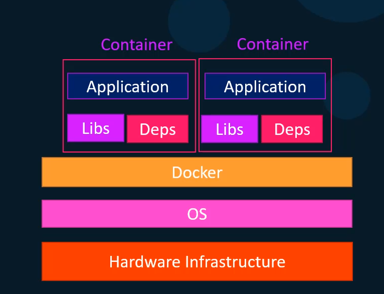
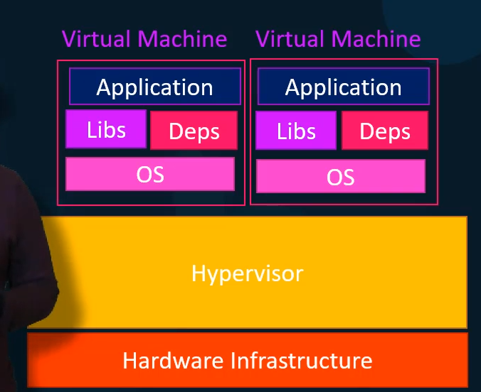
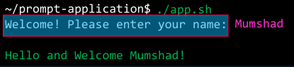
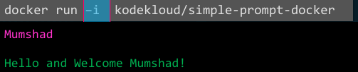
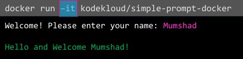
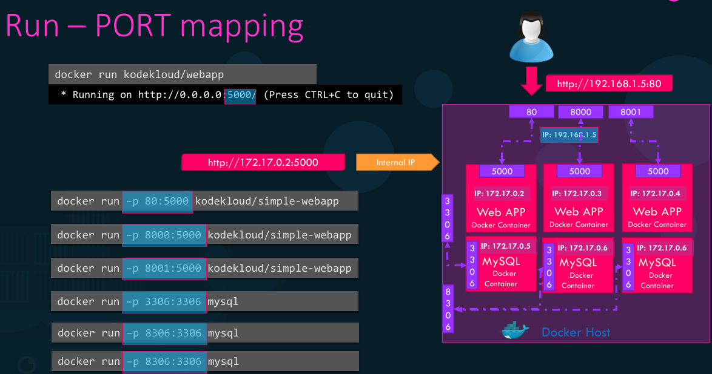
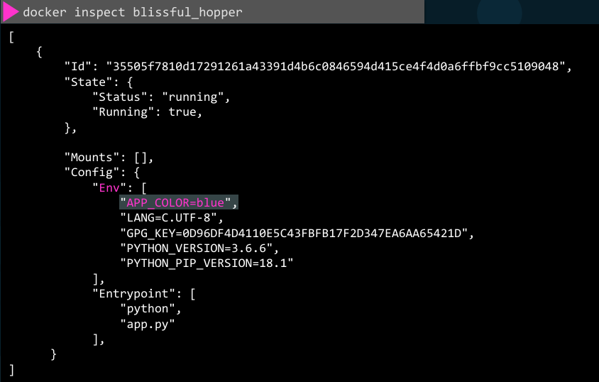
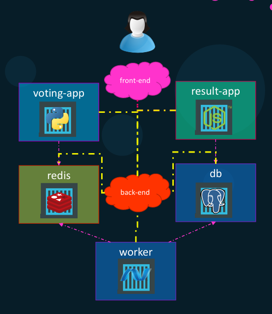

# Docker Overview

While working on a project we may have an application stack that includes different technologies. Each technology has its own Libraries and Dependencies. This often leads to compatibility issues with the underlying OS because we have to make sure each technology is compatible with the version of OS we were planning to use. Secondly, we had to check the compatibility between these services and the libraries and dependencies on the OS.

Every time there is a new developer on the team, they had to go through a large set of instructions and run hundreds of commands to finally set up their environment. Typically, we also have different environments (dev, test, prod, etc) therefore, we couldn't guarantee that the application that we were building would run the same way in different environments.

Docker comes in to play solve those issues. With docker you can create an architecture were each service/technology runs independently (in separate containers) with its own Dependencies and Libraries. All the containers can run on the same VM and the OS but withing separate environments or containers, we just had tu build the Docker configuration once. Thanks to this, developers can get started with a single docker run command.

## ¿What are containers?

Containers are completely isolated environments. As in they can have their own processes, services, network interfaces, their own mounts, just like VM's except they all share the same OS Kernel.

Docker utilizes LXC containers. Containers are meant to run a specific task or process, once it's completed, the container exits. A container only lives as long as the process inside it is alive.

## Containers vs. Virtual Machines (VM's)

Docker is installed above the OS, meaning that docker is installed on the OS. Docker has less isolation as more resources are shared between the containers.


With VM's, we have the hypervisor on the hardware and then the VM's on them. Each VM has its own OS inside it. This causes a higher utilization of underlying resources as there are multiple virtual OS and Kernel running. The VM's also consume higher disk space. Thanks to this, Docker containers boot up faster. They are completely isolated from each other.


The common approach is to have containers and VM's. When you have large environments with thousands of application containers running on thousands of docker hosts you will often see containers provisioned on virtual docker hosts

## Docker Images

An image is a package/template that is used to create one or more containers. Containers are running instances of images that are isolated and have their own environments and set up processes.

# Docker commands

## docker run

Is used to run a container from an image. syntax:

```sh
docker run imageName
```

If the image is not present on the host, it will go out to docker hub and pull the image down.

## docker ps

Is used to list all running containers and basic information about them. Each container automatically gets a random ID and name, it's created by Docker.

To see all containers regardless if they are running or not, use the -a flag

```sh
docker ps -a
```

## docker stop

To stop a running container. You must provide the container id or the container name.

```sh
docker stop containerNameOrID
```

## docker rm

Used when we want to get rid of a container. After running this command, if you see the container name, the command succeeded. You can remove more than one container with the same commands, you just have to separate each container with a blank space

```sh
docker rm containerName1 containerNID2
```

## docker images

See a list of all available images and their sizes on our host.

```sh
docker images
```

## docker rmi

Use this to remove an image. You must ensure that no containers are running off of the image before attempting to remove it. You must stop and delete all dependent containers to be able to delete an image.

```sh
docker rmi imageName
```

## docker pull

Use this to only pull an image and not run a container.

```sh
docker pull imageName
```

## docker exec

Use this command to execute a command on your running docker container.

```sh
docker exec containerName your-command
docker exec ubuntu-container cat /etc/hosts
```

## run attach/detach

When you run a container with the docker run containerName command, it will run in the foreground (attach mode) meaning you will be attached to the console or the standard out of the docker container and you will see the output of the specific service on your screen. You won't be able to do anything else on that console other than view the output until the docker container stops.

You can run a container in a detach mode. This will run the docker container in the background mode and you will be back to your prompt immediately.

```sh
docker run -d imageName
```

If you would like to attach back to the running detach container, run the docker attach command and specify the name or ID of the docker container:

```sh
docker attach containerNameOrID
```

If you're specifying the ID of a container in any Docker command, you can simply provide the first few characters alone just so it is different from the other containers ID.

# Docker run

As you may noticed when we use a docker run command, we only specified the image that we will use for that container, but we can also specify the version of the image that we want to use. By default, docker will use the image that has the tag "latest". We can indicate the specific tag that we want using the next syntax:

```sh
docker run yourImage:image.version
docker run ubuntu:4.04
```

Everything after the ":" is the . Docker will pull the image that has that tag. An image can have multiple tags related to it.

## Inputs

When we have an application that needs an input. If we use docker to run that application, it wouldn't for the input prompt. It will only perform the standard output. That is because by default, docker containers does not listen to a standard input, even though you are attached to its console. It doesn't have a terminal to read inputs from (runs in a non interactive mode). If you'd like to provide your input, you must map the standard input of your host to the Docker container using the next syntax:

```sh
docker run -i imageName
```

That parameter stands for interactive mode.

Expected behavior:


Current result:


Although we have provided the -i option, we are missing the "Welcome! Please enter your name: " prompt. That is because the application is prompted on the terminal, but we haven't attached to the containers terminal. In order to solve this, we can send the command with the -it option.

```sh
docker run -it imageName
```



## Port mapping or port publishing

The underlying host where Docker is installed is called Docker host (or Docker engine). When we run a containerized application, we are able to see that its running and we are able to access to that application with the next two options.

1. Use the IP of the Docker container: Every Docker container gets an IP assign by default. This is an internal IP that is only accessible within the Docker host.
2. Use the IP of the Docker host: For this to work, we must have mapped the port inside the Docker container to a free port on the host

```sh
docker run -p 80:5000 imageName
```

In the previous example, my users will have access to my application through Port 80 on my Docker host. As mentioned, my container is running on the port 5000 from the Docker container IP. All the traffic on port 80 on the docker host will get routed to port 5000 inside the Docker container.

This way, you can run multiple instances of your application and map them to different ports on the docker host or run instances of different applications on different ports. You cannot map to the port of the docker host more than once. You cannot add a port mapping while the service/container is running, first you have to stop it.


## Volume mapping

This is used to persist data in a Docker container. Docker containers have their own isolated file system. Any changes to any files happen within the container.

What happens if you were to delete a container and remove it? As soon as you do that, the container, along with all the data inside it gets blown away (all the data is gone). If you would like to persist data, you would want to map a directory outside the container on the docker host to a directory inside the container. This way, when the Docker container runs, it will implicitly mount the external directory to a folder inside the container. Therefore, all the data will be stored in the external volume and it will remain even if you delete the docker container.

```sh
docker run -v docker/host/folder:container/folder imageName
docker run -v /opt/datadir:/var/lib/mysql mysql
```

### Show the details of a container

It returns all details of a container in JSON format.

```sh
docker inspect containerNameOrID
```

## Container Logs

Useful to see the logs of container we run in the background. Logs are the contents written to the standard out of a container.

```sh
docker logs containerNameOrID
```

## Sending a command while running a container

```sh
docker run imageName your-command
docker run ubuntu cat /etc/*release*
```

# Docker images

With docker you can create your own images based on your own requirements. The first thing is to understand what application we are creating an image for and how its built.

The common steps are:

1. Create a Dockerfile
2. Install an OS (Ubuntu)
3. Update apt repo
4. Install dependencies using the apt command
5. Install software (python) dependencies using pip
6. Copy the source code of the application to a location (it will be copied to a folder within the container)
7. Define an ENTRYPOINT and run the server/code

Build the docker image

```sh
docker build . -f Docerfile -t yourImageName
```

This will create an image locally on your system. In order to make it available on the Public Docker Hub Registry, run the push command with the image tag we have just created. In order to publish to the docker hub, first you need to be logged in to your docker account.

You can only push to repositories under your own account.

```sh
docker login
#Type your username and password
docker push accountRepo/yourImageName
```

## Dockerfile

Is a text file written in an specific format that docker can understand. It follow the "instruction argument" format. Every docker image must be based off of another image, either an OS or another image that was created.

```Dockerfile
FROM Ubuntu

RUN apt-get update && apt-get -y install python python-pip
RUN pip install flask flask-mysql
COPY . /opt/source-code
ENTRYPOINT FLASK_APP=/opt/source-code/app.py flask run
```

| INSTRUCTION | ARGUMENT                                    | USE                                                                     |
| :---------- | :------------------------------------------ | :---------------------------------------------------------------------- |
| FROM        | Ubuntu                                      | All docker files must start with this instruction                       |
| RUN         | apt-get update && apt-get -y install python | Run a particular command on the base images                             |
| COPY        | . /opt/source-code                          | Copy a file from the local system onto the image                        |
| ENTRYPOINT  | FLASK_APP=/opt/source-code/app.py flask run | Specify a command that will be run when the image is run as a container |

When a docker image is built. Each line of instruction creates a new layer in the Docker image with just the changes from the previous
layer. All the layers built are cached by Docker. Thanks to this, in case a particular step was to fail, it will reuse the previous layers from cache and continue to build the remaining layers. The same is true if you were to add additional steps in the Docker file. You can see the size for each step using the history command:

```sh
docker history yourImageName
```

# Environment Variables

You can set up environment variables for your container each time you run it. In order to do so, you just have to use this command:

```sh
docker run -e VARIABLE_NAME=value yourImageName
```

You can also at the environment variables when a container is already running:

```sh
docker inspect yourContainerNameOrID
```

When you run this command it will display all the information related to that container in a JSON format, inside the Config section you can find all the environment variables inside the "Env" object:



# Command vs Entrypoint

Containers are not meant to run an OS, they are meant to run a specific task or process. Therefore, containers only live as long as the process inside it is alive. But, who defines what process is run within the container? There are commands inside the Dockerfiles that created the base images. These commands indicate what will be executed when a container is run based on a certain image.

## CMD command

It defines the program that will run within the container. It's the most common for base images.

How can we specify a different command to start a container?

1. Append a command to the Docker run command, and that way it overrides the default command specified within the image.

```sh
docker run yourImageName [COMMAND]
docker run ubuntu sleep 5
```

2. As you may notice, you will have to indicate to command every time you run a container from that image, but can we make that change permanent? Within your Docker file yo can add a CMD instruction that can have either the command simply as in a shell form or in a JSON array format. Remember that when you use the JSON array format, the first element should be the executable.

```Dockerfile
CMD command param1
CMD ["command", "param1"]
#Example
CMD ["sleep", "5"]

```

## ENTRYPOINT

With the previous approach we were able to create an image that will always sleep 5 seconds before exiting. The issue with this is that every time we run a container it will sleep 5 seconds, but if we wanted to increase/decrease the number of seconds we would still need the first approach (send the command with the run command to override the sleep 5 command). In order to solve this we have the ENTRYPOINT instruction.

The ENTRYPOINT instruction is like the CMD instruction, as you can specify the program that will be run when the container starts. Then whatever you specify on the command line will get appended to the ENTRYPOINT.

```Dockerfile
FROM ubuntu
ENTRYPOINT ["sleep"]
```

Thanks to this approach, when you run a container based on that image you just have to pass the params.

```sh
docker run yourImageName [PARAMS]
docker run ubuntu 10
```

Will be equivalent to run a "sleep 10" when the container starts.

### Default values for startup

Since we are using an ENTRYPOINT command, we are required to send the param whenever we run a container, otherwise, the command will fail if it needs the params. To solve this issue, we can configure a default value for the command if it's not specified in the command line.

In order to this, we are going to mix both the ENTRYPOINT and CMD instructions.

```Dockerfile
ENTRYPOINT command
CMD defaultParam
#Example
FROM ubuntu
ENTRYPOINT ["sleep"]
CMD ["5"]
```

In this case, the CMD instruction will be appended to the ENTRYPOINT instruction. At startup, the command would be "sleep 5" if you didn't specified any parameters in the command line, if you did, then that will override the CMD instruction.

For this to happen, you must specify the ENTRYPOINT and CMD instructions in a JSON format.

Finally, as mentioned, by now you will only be able to modify the CMD command (when using the combination between the CMD and ENTRYPOINT instructions). Can we also change the ENTRYPOINT value? Yes, by using the --entrypoint option in the Docker run command. Here is an example:

```sh
docker run --entrypoint [NEW_COMMAND] yourImageName [PARAMS]
# Since we are just updating the ENTRYPOINT instruction, and we have a CMD instruction with the default params, that section is optional.
docker run --entrypoint sleep2.0 ubuntu 15
```

# Docker Compose

We have been working with docker run so far. But in common scenarios, we will need to set up a complex application running multiple services. Therefore, a better way to do it is to use Docker Compose.

With Docker Compose we can create a configuration file in YAML format called docker-compose.yml and put together different services and the options specific to running them in this file. Then we could simply run a docker-compose command to bring up an entire application stack.

Docker compose makes it easier to implement, run and maintain as all changes are always stored in the docker-compose configuration file. Tis is all only applicable to running containers on a single Docker host.

## From now on, we will be referring to the next voting application stack:



**Remember, by this time it's super important that you always assign a name to your containers**

There are two approaches for running a complete stack of services in a single Docker engine/host, these are:

1. Run separate containers and use the --link option to create a link between two containers. You will have to add every link that you need for each service/container that you create. Here is an example for the voting-app stack:

The voting app web service (written in python) is dependent on the redis service when the web server starts. When the web server starts it looks for a redis service running on host Redis, but the voting app container cannot resolve a host. In order to solve this, we need to add a link when running the voting-app container to link it to the redis container.

```sh
docker run -d --name=dependentContainer -p 5000:80 --link dependencyContainerName:hostThatServiceWillLookUp imageName
```

Example for voting service architecture:

```sh
docker run -d --name=redis redis
docker run -d --name=voting-app -p 5000:80 --link redis:redis voting-app
```

What the command is in fact doing is it creates an entry into the etc host file on the container that has the dependency. In this case the host will be included within the etc host file in the voting-app container with the IP of the redis container and the alias "redis".

Complete example using docker run and links:

```sh
docker run -d --name=redis redis
docker run -d --name=voting-app -p 5000:80 --link redis:redis voting-app
docker run -d --name=db postgres
docker run -d --name=result -p 5001:80 --link db:db result-app
docker run -d --name=worker --link db:db --link redis:redis worker
```

**Using links like we used for the worker container is deprecated and the support may be removed in the future in Docker.**

2. Using Docker compose: Once we have the Docker run commands tested and ready, its easier to generate a Docker compose file from it. We start by creating a dictionary of container names. The key will be the container name, within that key, we have to specify the image, finally all the options that we set in the docker run command as other values (remember that it follows the YAML syntax). Finally we can use a links property that can have a list inside it, whichever container requires the link will have that property and provide an array. The array will have as values all the keys that we defined (which as mentioned, are all the container names).

When assigning values to the links property, as you may remember from the docker run we have to specify both the source and target (--link dependencyContainerName:hostThatServiceWillLookUp). If we only specify a single value, without the source:targe structure, the engine will assume that the source and target have the same value.

### Resulting docker-compose file:

```YAML
redis:
    image: redis
db:
    image: postgres:9.4
voting-app:
    image: voting-app
    ports:
        - 5000:80
    links:
        - redis
result:
    image: result-app
    ports:
        - 5001:80
    links:
        - db
worker:
    image: worker
    links:
        - redis
        - db

```

Once we have our docker-compose.yml file ready, bringing up the stack is really simple. In order to do this we have to use the next command:

```sh
docker-compose up
```

## Docker Compose build

We have assumed that all images are already built. Some images (redis and postgres) may be available on Docker Hub. But we have also use custom images (voting-app, result, worker) that are our own applications. Its not necessary that all images are already built and available in the Docker registry. We can instruct docker-compose to run a Docker build instead of pulling an image. In order to do so, we simply need to replace the "image" property with a "build" property and specify the location were the engine can find our Dockerfile for that image. After these changes, the docker-compose.yml file has to look like this:

```YAML
redis:
    image: redis
db:
    image: postgres:9.4
voting-app:
    build: ./vote
    ports:
        - 5000:80
    links:
        - redis
result:
    build: ./result
    ports:
        - 5001:80
    links:
        - db
worker:
    build: ./worker
    links:
        - redis
        - db

```

This time, when we run the docker-compose up command, it will:

1. Build the images
2. Give a temporary name the built images
3. Use those images to run containers using the options you specified

## Docker Compose versions

There are different formats for docker-compose files because, docker-compose keeps evolving over time. By default, the engine will assume that you are working under version 1. For version two and up, you must specify the version of Docker compose file you are intending to use by adding a version key at the top of the file.

- Version one: Is the one we've used in the previous example. This version Had a lot of limitations. For example, all containers ere deployed on the same default bridge network, you cannot change that while working in this version. You cannot specify dependencies between containers, what this means is that you were not able to start a container only after another one was up and running.
- Version two and up: Came with the support for pre-requisites to run a container. You no longer specify your stack information directly as we did before, it is all encapsulated in a "services" section/property and inside of that property you would specify your stack information. Another difference is with networking, in v1 docker-compose attached all the containers it runs to a default bridge network, then it used links to enable communication between containers. For v2, docker-compose automatically creates a dedicated bridge network for the application, then it attaches all containers to that new network.Thanks to this, all containers are able to communicate with each other using each other's service name. Basically, you don't need to use links in version two and above of docker-compose. Finally, v2 introduced a "depends on" feature. With this, you can specify a startup order by adding a "depends_on" property for each service, the value of that property will be the list of services that must be up and running before the new service starts.

```YAML
version: "2"
Services:
    redis:
        image: redis
    db:
        image: postgres:9.4
    voting-app:
        build: ./vote
        ports:
            - 5000:80
        depends_on:
            - redis
    result:
        build: ./result
        ports:
            - 5001:80
        depends_on:
            - db
    worker:
        build: ./worker
        depends_on:
            - redis
            - db

```

- Version three (latest by the time): It's similar to v2 in the structure, it has a version and services properties at root level. This version comes with support for Docker swarm.

# Networking with Docker Compose

**Remember that this is available for version two and up of docker-compose**

So far, we've been just deploying all the containers on the default bridge network. In the real world it doesn't work like that, we should contain the traffic from the different sources. For example, separate the user generated traffic (front-end network in the diagram) from the application's internal traffic (back-end network in the diagram). We first create the networks and then connect all the components to their corresponding network. To create the networks we have a new property called "networks". The value of that new property will be all the networks that we want to create. Each network will be an object within the "networks" property. Then, under each service create a networks property and provide the list of networks that service must be attached to.

```YAML
version: "2"
Services:
    redis:
        image: redis
        networks:
            - back-end
    db:
        image: postgres:9.4
        networks:
            - back-end
    voting-app:
        build: ./vote
        ports:
            - 5000:80
        depends_on:
            - redis
        networks:
            - back-end
            - front-end
    result:
        build: ./result
        ports:
            - 5001:80
        depends_on:
            - db
        networks:
            - back-end
            - front-end
    worker:
        build: ./worker
        depends_on:
            - redis
            - db
        networks:
            - back-end
networks:
    front-end:
    back-end:
```

# Repo for voting-app source code

[Link to official docker samples repo with voting-app source code](https://github.com/dockersamples/example-voting-app)
